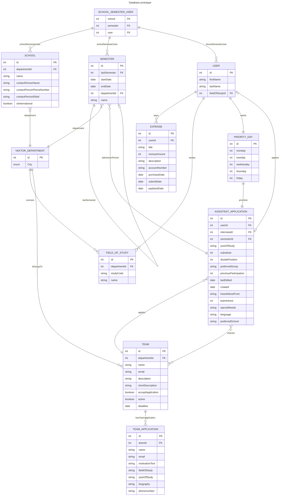

# Database prototype

```mermaid
---
title: Database prototype
---
erDiagram
    USER {
        int id PK
        string firstName
        string lastName 
        int fieldOfStudyId FK
    }
    EXPENSE {
        int id PK
        int userId FK
        string title
        int moneyAmount
        string description
        string accountNumber
        date purchaseDate
        date submitDate
        date paybackDate
    }
    FIELD_OF_STUDY {
        int id PK
        int departmentId FK
        string studyCode
        string name
    }
    VEKTOR_DEPARTMENT {
        int id PK
        enum City
    }
    TEAM {
        int id PK
        int departmentId FK
        string name
        string email
        string description
        string shortDescription
        boolean acceptApplication
        boolean active
        date deadline
    }
    TEAM_APPLICATION {
        int id PK
        int teamId FK
        string name
        string email
        string motivationText
        string fieldOfStudy
        string yearOfStudy
        string biography
        string phonenumber
    }
    ASSISTENT_APPLICATION{
        int id PK
        int userId FK
        int interviewId FK
        int semesterId FK
        string yearOfStudy
        int substitute
        int doublePosition
        string preferredGroup
        int previousParticipation
        date lastEdited
        date created
        string heardAboutFrom
        int teamIntrest
        string specialNeeds
        string language
        string preferredSchool
    }
    PRIORITY_DAY{
        int id PK
        int monday
        int tuesday
        int wednesday
        int thursday
        int friday
    }
    SEMESTER{
        int id PK
        int lastSemester FK
        date startDate
        date endDate
        int departmentId FK
        string name
    }
    SCHOOL{
        int id PK
        int departmentId FK
        string name
        string contactPersonName
        string contactPersonPhoneNumber
        string contactPersonEMail
        boolean isInternational
    }
    SCHOOL_SEMESTER_USER{
        int school FK
        int semester FK
        int user FK
    }
    USER ||--o{ EXPENSE : "pays"
    USER ||--o{ FIELD_OF_STUDY : studys
    VEKTOR_DEPARTMENT ||--o{ FIELD_OF_STUDY : oversee
    TEAM ||--o{ TEAM_APPLICATION : hasTeamapplication
    ASSISTENT_APPLICATION |o--o| USER : applies
    ASSISTENT_APPLICATION }O--|| TEAM : applies
    PRIORITY_DAY ||--|| ASSISTENT_APPLICATION : prioritize
    USER ||--|| PRIORITY_DAY : wants
    TEAM }o--o{ ASSISTENT_APPLICATION : interest
    VEKTOR_DEPARTMENT ||--O{ TEAM : belongsTo
    SEMESTER ||--o| SEMESTER : lastSemester
    SEMESTER }|--|| VEKTOR_DEPARTMENT : department
    SCHOOL }|--|| VEKTOR_DEPARTMENT : department
    SEMESTER }o--|| ASSISTENT_APPLICATION : admissionPeriod
    SCHOOL_SEMESTER_USER ||--o{ SCHOOL : schoolSemesterUser
    SCHOOL_SEMESTER_USER ||--o{ SEMESTER : schoolSemesterUser    
    SCHOOL_SEMESTER_USER ||--o{ USER : shcoolSemesterUser
```
